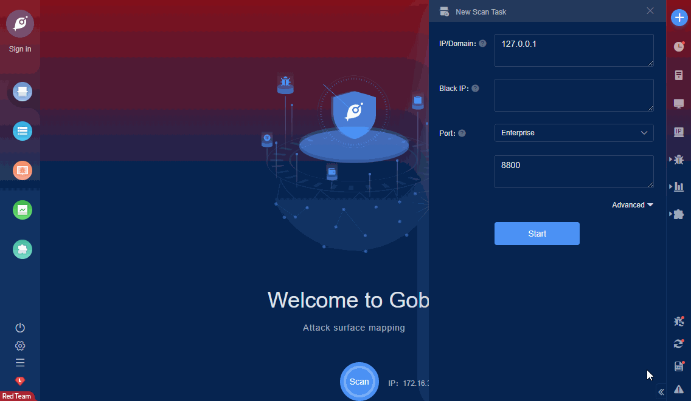

# AVCON-6 download.action File Read (CNVD-2020-30193)

The AVCON-6 system management platform download.action and org_execl_download.action have arbitrary file download vulnerabilities. Attackers can download arbitrary files on the server through the vulnerabilities.

FOFA **query rule**: [app="AVCON-6"](https://fofa.so/result?qbase64=YXBwPSJBVkNPTi02Ig%3D%3D)

# Demo

