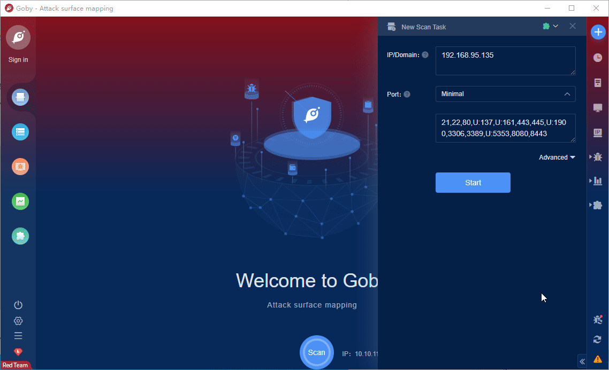

# CVE-2021-30128 Apache OFBiz  RCE

Apache OFBiz has unsafe deserialization prior to 17.12.06. An unauthenticated attacker can use this vulnerability to successfully take over Apache OFBiz.

**Affected version**: Apache OFBiz 17.12.06

**[FOFA](https://fofa.so/result?q=header%3D%22Set-Cookie%3A+OFBiz.Visitor%22&qbase64=aGVhZGVyPSJTZXQtQ29va2llOiBPRkJpei5WaXNpdG9yIg%3D%3D&file=&file=) query rule**: header="Set-Cookie: OFBiz.Visitor"

# Demo

