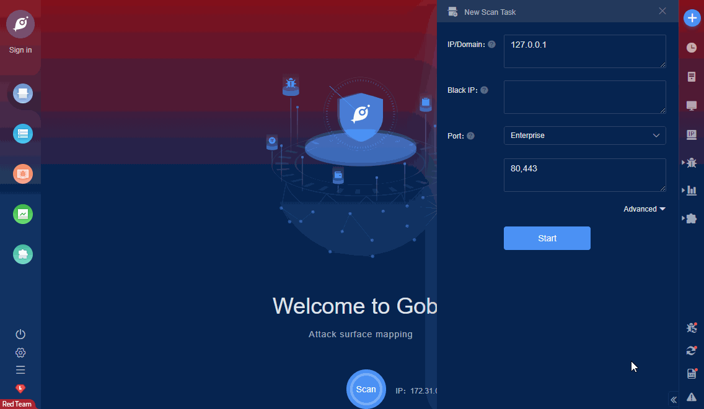

# Atlassian Confluence RCE (CVE-2021-26084)

In affected versions of Confluence Server and Data Center, an OGNL injection vulnerability exists that would allow an authenticated user, and in some instances an unauthenticated user, to execute arbitrary code on a Confluence Server or Data Center instance. The vulnerable endpoints can be accessed by a non-administrator user or unauthenticated user if ‘Allow people to sign up to create their account’ is enabled. To check whether this is enabled go to COG > User Management > User Signup Options. The affected versions are before version 6.13.23, from version 6.14.0 before 7.4.11, from version 7.5.0 before 7.11.6, and from version 7.12.0 before 7.12.5.

FOFA **query rule**: [app="ATLASSIAN-Confluence"](https://fofa.so/result?qbase64=YXBwPSJBVExBU1NJQU4tQ29uZmx1ZW5jZSI%3D)

# Demo

