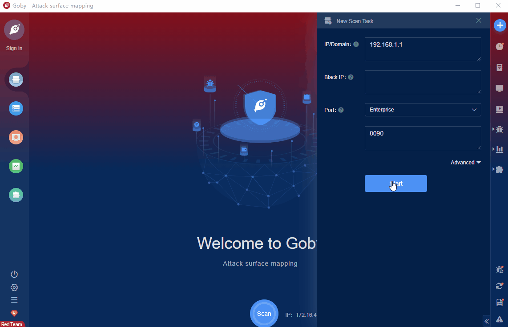

# Atlassian Confluence Webwork OGNL Inject (CVE-2022-26134)

Atlassian confluence server is a server version of atlassian company that has enterprise knowledge management functions and supports collaborative software for building enterprise wikis.&nbsp;Atlassian confluence has an ognl injection vulnerability that allows authenticated users (in some cases unauthenticated users) to execute arbitrary code on the confluence server. 

FOFA **query rule**: [(header="X-Confluence-" && header!="TP-LINK Router UPnP") || (banner="X-Confluence-" && banner!="TP-LINK Router UPnP") ](https://fofa.info/result?qbase64=KGhlYWRlcj0iWC1Db25mbHVlbmNlLSIgJiYgaGVhZGVyIT0iVFAtTElOSyBSb3V0ZXIgVVBuUCIpIHx8IChiYW5uZXI9IlgtQ29uZmx1ZW5jZS0iICYmIGJhbm5lciE9IlRQLUxJTksgUm91dGVyIFVQblAiKSA%3D)

# Demo

