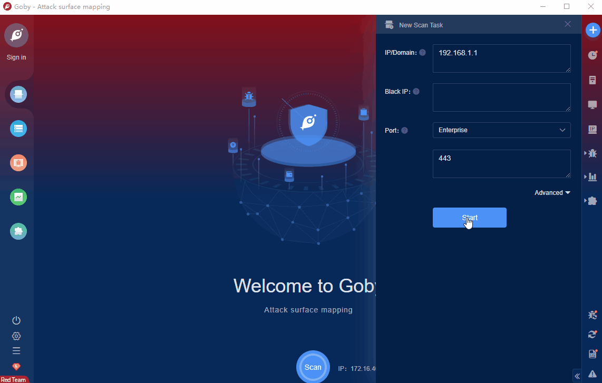

# Bitbucket Data Center Unauthenticated Remote Code Execution Vulnerability (CVE-2022-26133)

Atlassian Bitbucket Data Center is Atlassian's Git repository management solution that provides source code collaboration for enterprises that require high availability and performance at scale.This vulnerability is caused by a deserialization vulnerability because the Hazelcast interface function in Atlassian Bitbucket Data Center does not filter user data effectively. An attacker can exploit this vulnerability to construct malicious data to execute arbitrary code remotely.

FOFA **query rule**: [ body="com.atlassian.plugins.atlassian-plugins-webresource-plugin:context-path.context-path" || title="Atlassian Bitbucket"](https://fofa.info/result?qbase64=IGJvZHk9ImNvbS5hdGxhc3NpYW4ucGx1Z2lucy5hdGxhc3NpYW4tcGx1Z2lucy13ZWJyZXNvdXJjZS1wbHVnaW46Y29udGV4dC1wYXRoLmNvbnRleHQtcGF0aCIgfHwgdGl0bGU9IkF0bGFzc2lhbiBCaXRidWNrZXQi)

# Demo

