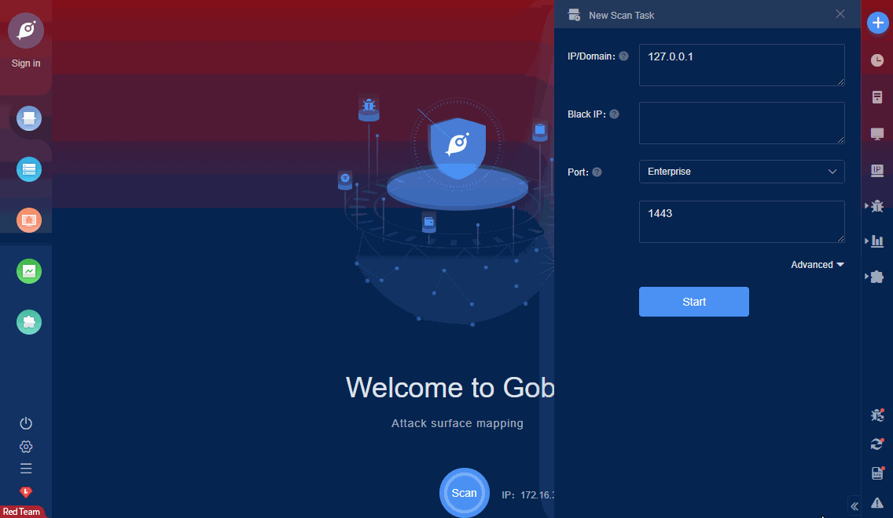

# Bithighway L7 Auth RCE (CNVD-2021-37007)

Bihaiwei L7 cloud router wireless operation version has command execution vulnerabilities. An attacker can use this vulnerability to gain control of the server.

FOFA **query rule**: [banner="L7Engine"](https://fofa.so/result?qbase64=YmFubmVyPSJMN0VuZ2luZSI%3D)

# Demo

