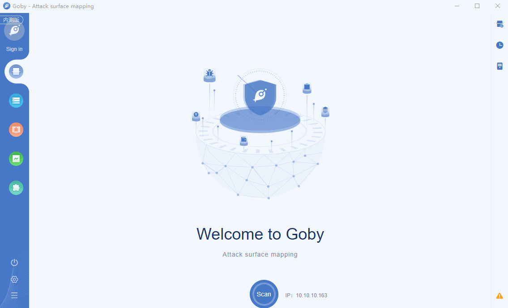

# RDP weak password

The RDP server is using a weak password. Attacker will be able to guess the credentials required to access this resource.\nA weak password is short, common, a system default, or something that could be rapidly guessed by executing a brute force attack using a subset of all possible passwords, such as words in the dictionary, proper names, words based on the user name or common variations on these themes.

**[FOFA](https://fofa.so/result?q=protocol%3Drdp&qbase64=cHJvdG9jb2w9cmRw&file=&file=) query rule**: protocol=rdp

# Demo

