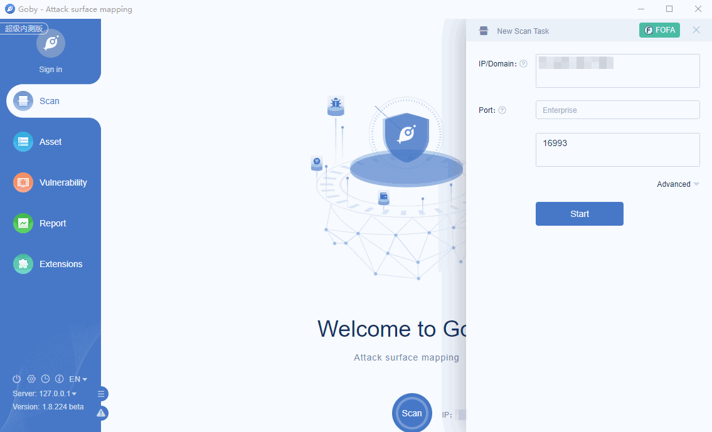

# CVE-2020-14864 Oracle Application Server File Read

Vulnerability in the Oracle Business Intelligence Enterprise Edition product of Oracle Fusion Middleware (component: Installation). Supported versions that are affected are 5.5.0.0.0, 12.2.1.3.0 and 12.2.1.4.0. Easily exploitable vulnerability allows unauthenticated attacker with network access via HTTP to compromise Oracle Business Intelligence Enterprise Edition. Successful attacks of this vulnerability can result in unauthorized access to critical data or complete access to all Oracle Business Intelligence Enterprise Edition accessible data. CVSS 3.1 Base Score 7.5 (Confidentiality impacts). CVSS Vector: (CVSS:3.1/AV:N/AC:L/PR:N/UI:N/S:U/C:H/I:N/A:N).

**Affected version**: business_intelligence 5.5.0.0.0, 12.2.1.3.0, 12.2.1.4.0

**[FOFA](https://fofa.so/result?q=app%3D%22Oracle-Application-Server%22&qbase64=YXBwPSJPcmFjbGUtQXBwbGljYXRpb24tU2VydmVyIg%3D%3D&file=&file=) query rule**: app="Oracle-Application-Server"

# Demo

