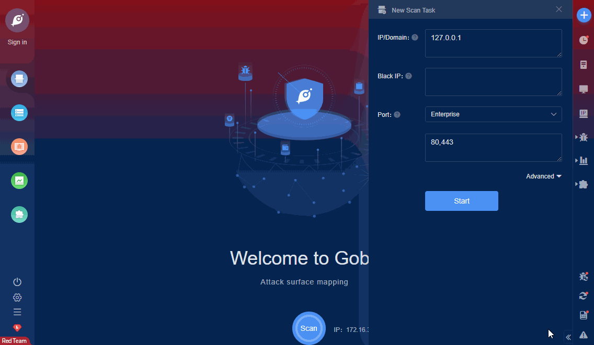

# Chemex Auth File Upload CNVD-2021-15573

Coffee pot Chemex is a free, open source, efficient and beautiful IT operation and maintenance management platform. Chemex has a background file upload vulnerability(default login admin:admin), which can be exploited by attackers to gain control of the server.

FOFA **query rule**: [(title="咖啡壶" || body="让IT资产管理更加简单") && body="CreateDcat"](https://fofa.so/result?qbase64=KHRpdGxlPSLlkpbllaHlo7YiIHx8IGJvZHk9IuiuqUlU6LWE5Lqn566h55CG5pu05Yqg566A5Y2VIikgJiYgYm9keT0iQ3JlYXRlRGNhdCI%3D)

# Demo

