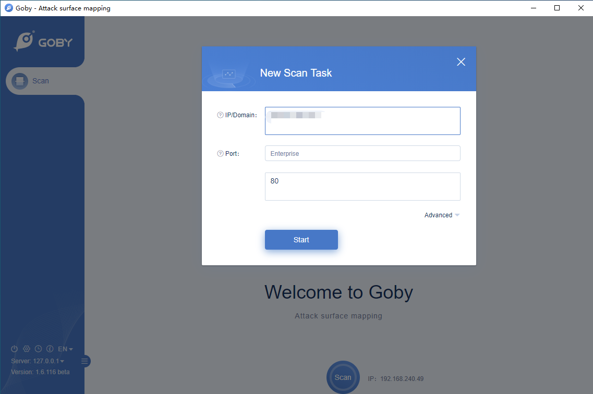
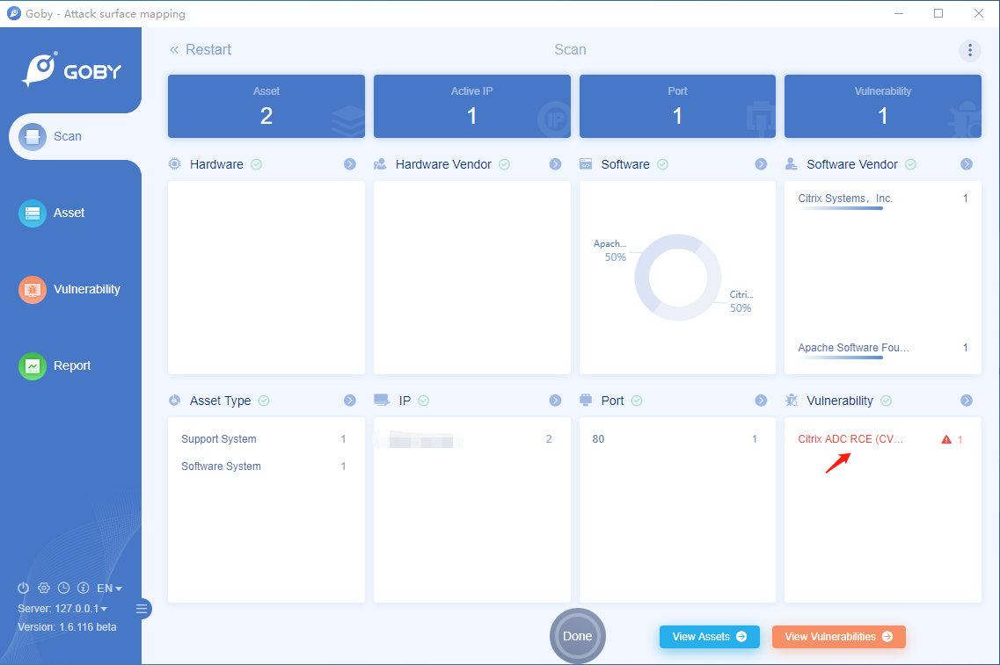
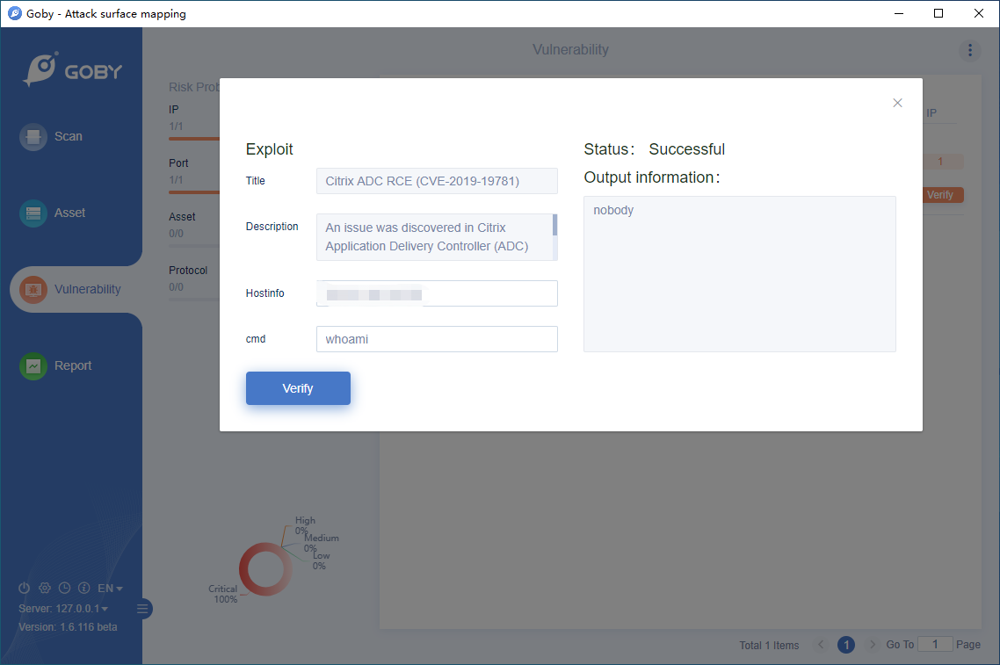

# CVE-2019-19781 Citrix ADC Remote Code Execution Vulnerability

An issue was discovered in Citrix Application Delivery Controller (ADC) and Gateway 10.5, 11.1, 12.0, 12.1, and 13.0. They allow Directory Traversal.

**Affected version**: 10.5, 11.1, 12.0, 12.1, 13.0

**[FOFA](https://fofa.so/result?qbase64=YXBwPSJDaXRyaXgtQURDIg%3D%3D) query rule**: app="Citrix-ADC"

# Demo

