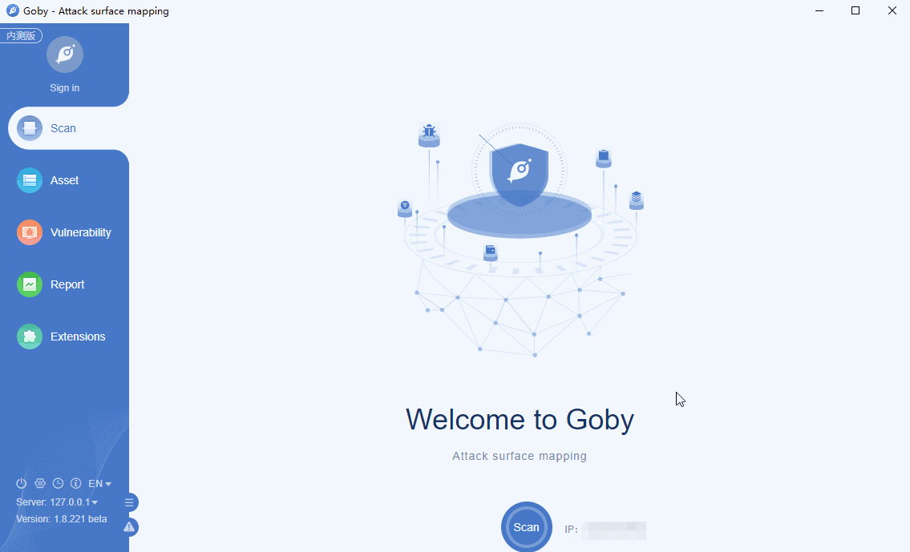

# CVE-2020-8209 Citrix XenMobile Arbitrary file read

Improper access control in Citrix XenMobile Server 10.12 before RP2, Citrix XenMobile Server 10.11 before RP4, Citrix XenMobile Server 10.10 before RP6 and Citrix XenMobile Server before 10.9 RP5 and leads to the ability to read arbitrary files.

**Affected version**: 10.12, 10.11, 10.10, 10.9

**[FOFA](https://fofa.so/result?q=title%3D%22XenMobile%22&qbase64=dGl0bGU9Ilhlbk1vYmlsZSI%3D&file=&file=) query rule**: title="XenMobile"

# Demo

