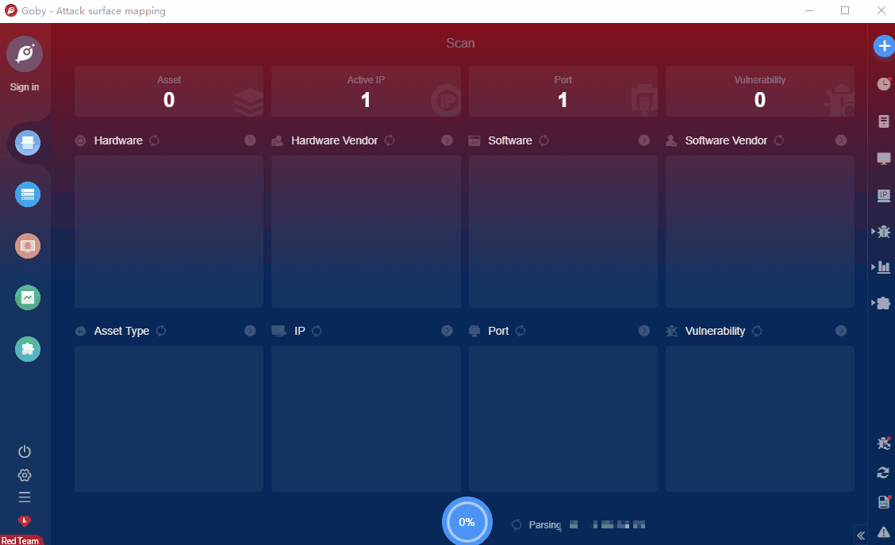

# Clinical Browsing System login.php Boolean SQLi

There is a Boolean SQL injection vulnerability in the login of clinical browsing system. Through this vulnerability, an attacker can directly log in to the system using the universal password such like \"1'or 1='1\", and even obtain sensitive information in the database through Boolean blind injection.

**FOFA query rule**: [body="/KView/ChromeBrowser.exe"](https://fofa.so/result?qbase64=Ym9keT0iL0tWaWV3L0Nocm9tZUJyb3dzZXIuZXhlIg%3D%3D)

# Demo

