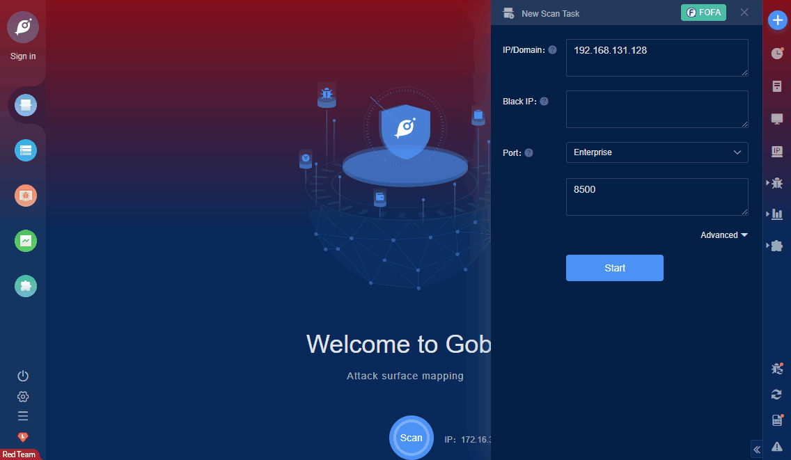

# Consul Service API RCE

Under a specific configuration, a malicious attacker can remotely execute commands on the Consul server without authorization by sending a carefully constructed HTTP request.

**FOFA query rule**: [title="Consul by HashiCorp" || protocol="consul(http)"](https://fofa.so/result?qbase64=dGl0bGU9IkNvbnN1bCBieSBIYXNoaUNvcnAiIHx8IHByb3RvY29sPSJjb25zdWwoaHR0cCki)

# Demo

