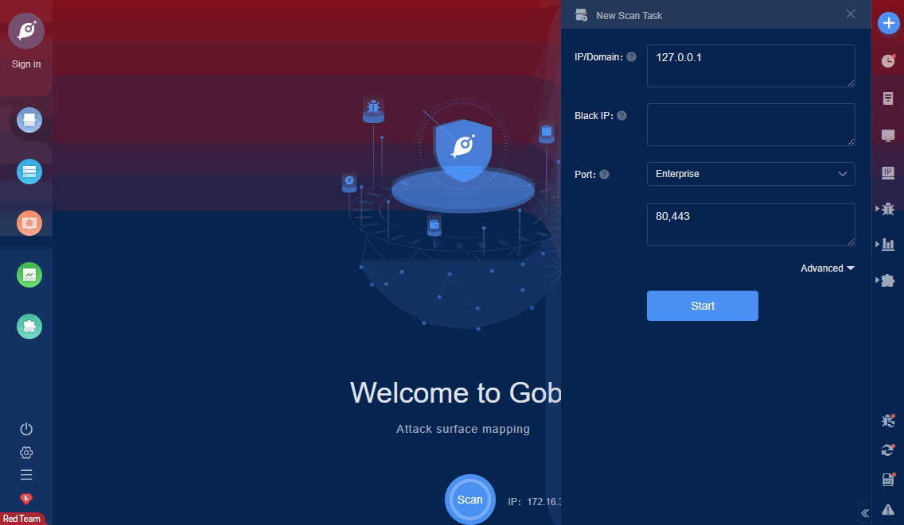

# Doccms keyword sqli

DocCMS keyword parameter has SQL injection vulnerability, attacker can obtain database information through the vulnerability.

FOFA **query rule**: [app="Doccms"](https://fofa.so/result?qbase64=YXBwPSJEb2NjbXMi)

# Demo

