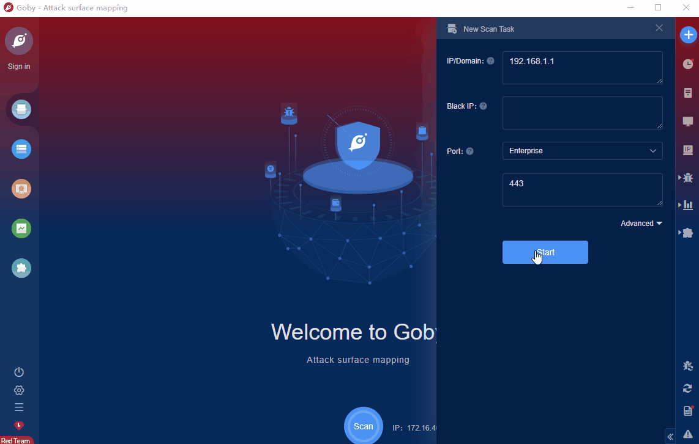

# dotCMS content Arbitrary File Upload (CVE-2022-26352)

Dotcms dotCMS is a set of content management system (CMS) of American dotCMS (Dotcms) company. The system supports RSS feeds, blogs, forums and other modules, and is easy to expand and build.There is an arbitrary file upload vulnerability in the /api/content/ path of the DotCMS management system, and attackers can upload malicious Trojans to obtain server permissions.

FOFA **query rule**: [body="DotCMS"](https://fofa.info/result?qbase64=Ym9keT0iRG90Q01TIg%3D%3D)

# Demo

