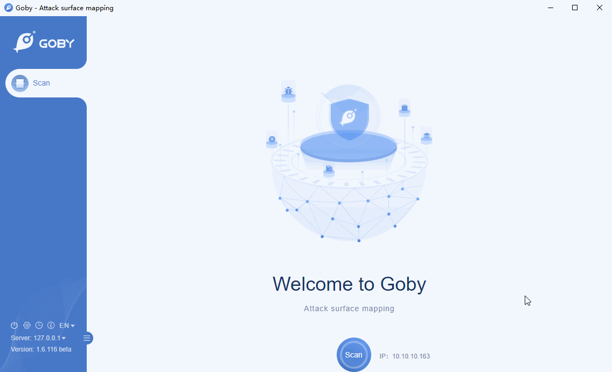

# CVE-2018-7600 Drupal Remote Code Execution Vulnerability

Drupal is an open source content management framework (CMF) written in PHP. It consists of a content management system (CMS) and a PHP development framework.

Drupal had insufficient input sanitation on Form API (FAPI) AJAX requests. As a result, this enabled an attacker to potentially inject a malicious payload into the internal form structure. This would have caused Drupal to execute it without user authentication. By exploiting this vulnerability an attacker would have been able to carry out a full site takeover of any Drupal customer.

**Affected version**: Drupal 6 - 8

**[FOFA](https://fofa.so/result?qbase64=YXBwPSJEcnVwYWwi) query rule**: app="Drupal"

# Demo

