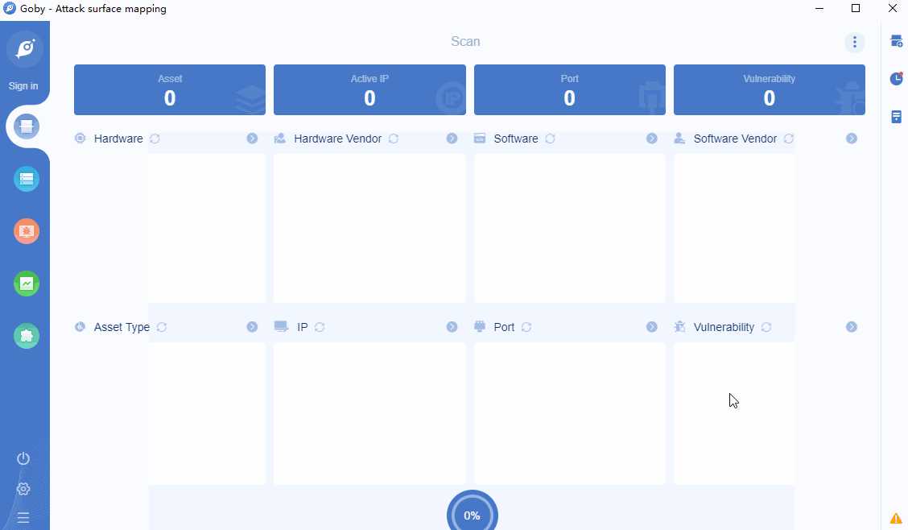

# CVE-2019-6340 Drupal Core Arbitrary PHP Code Execution Vulnerability

Drupal is an open source content management framework (CMF) written in PHP. It consists of a content management system (CMS) and a PHP development framework.

Some field types do not properly sanitize data from non-form sources in Drupal 8.5.x before 8.5.11 and Drupal 8.6.x before 8.6.10. This can lead to arbitrary PHP code execution in some cases. A site is only affected by this if one of the following conditions is met: The site has the Drupal 8 core RESTful Web Services (rest) module enabled and allows PATCH or POST requests, or the site has another web services module enabled, like JSON:API in Drupal 8, or Services or RESTful Web Services in Drupal 7. (Note: The Drupal 7 Services module itself does not require an update at this time, but you should apply other contributed updates associated with this advisory if Services is in use.

**Affected version**:  8.5.x before 8.5.11、8.6.x before 8.6.10

**[FOFA](https://fofa.so/result?qbase64=YXBwPSJEcnVwYWwi) query rule**: app="Drupal"

# Demo

