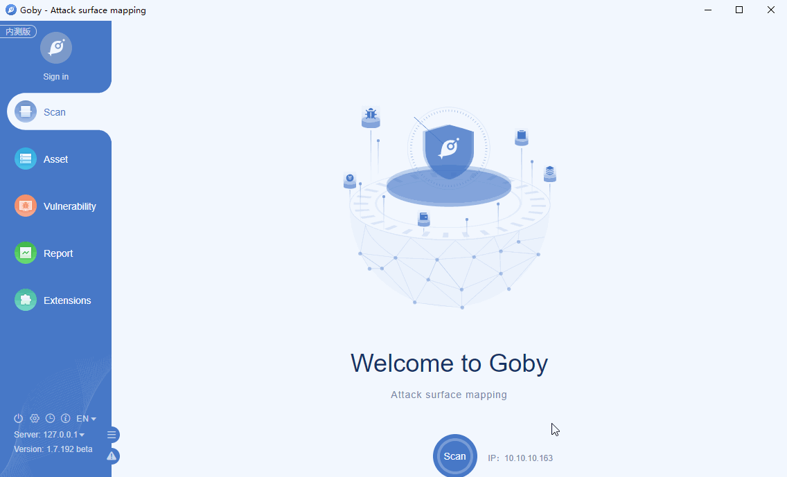

# CVE-2020-1948 Dubbo RCE 

This vulnerability can affect all Dubbo users stay on version 2.7.6 or lower. An attacker can send RPC requests with unrecognized service name or method name along with some malicious parameter payloads. When the malicious parameter is deserialized, it will execute some malicious code.

**Affected version**: apache dubbo 2.5.0 - 2.5.10, 2.6.0 - 2.6.7, 2.7.0 - 2.7.6

**[FOFA](https://fofa.so/result?q=protocol%3D%3D"apache-dubbo"&qbase64=cHJvdG9jb2w9PSJhcGFjaGUtZHViYm8i&file=&file=) query rule**: protocol=="apache-dubbo"

# Demo

