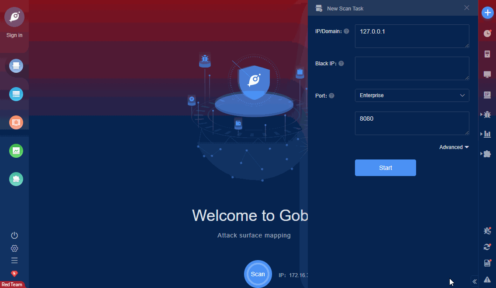

# Dwsurvey 3.2 Arbitrary File Read

DWSurvey is a convenient, efficient and stable survey questionnaire system, an open source questionnaire form system based on JAVA WEB. The filePath parameter of the ToHtmlServlet.java file in the dwsurvey-oss-v3.2.0 version has an arbitrary file reading vulnerability.

FOFA **query rule**: [app="DIAOWEN-问卷表单系统"](https://fofa.so/result?qbase64=YXBwPSJESUFPV0VOLemXruWNt%2BihqOWNleezu%2Be7nyI%3D)

# Demo

