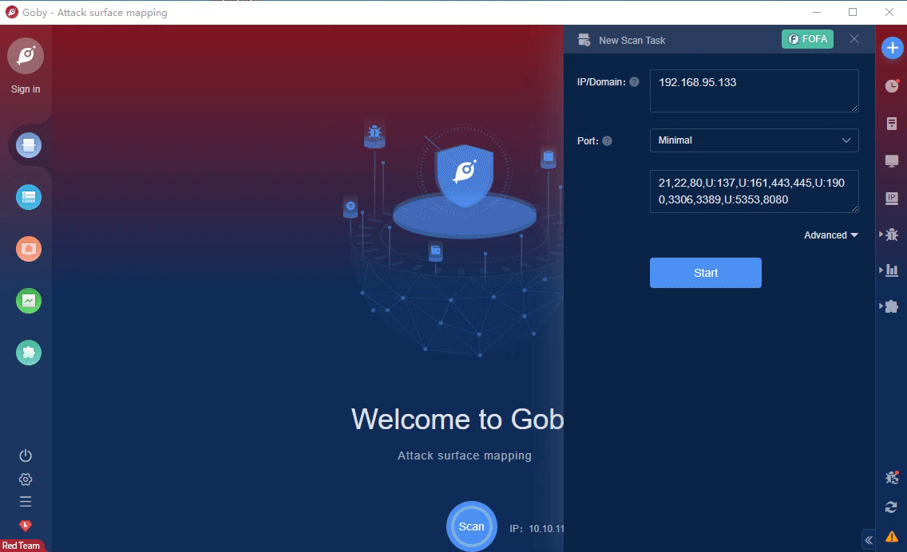

# CVE-2021-22986 F5 BIGIP iControl unauth RCE

F5 Big-IP, an application delivery platform for F5 Corporation, issued a security bulletin today, announcing seven security vulnerabilities related to Big-IP and Big-IQ.Among them, CVE-2021-22986 is an unauthenticated remote command execution vulnerability. Due to incomplete authentication of HTTP requests, it allows attackers to bypass permission authentication and access Big-IP REST API to execute commands by setting special HTTP headers.

**Affected version**: F5-BIGIP

**[FOFA](https://fofa.so/result?q=title%3D%22BIG-IP%22+%7C%7C+app%3D%22F5-BIGIP%22&qbase64=dGl0bGU9IkJJRy1JUCIgfHwgYXBwPSJGNS1CSUdJUCI%3D&file=&file=) query rule**: title="BIG-IP" || app="F5-BIGIP"

# Demo

