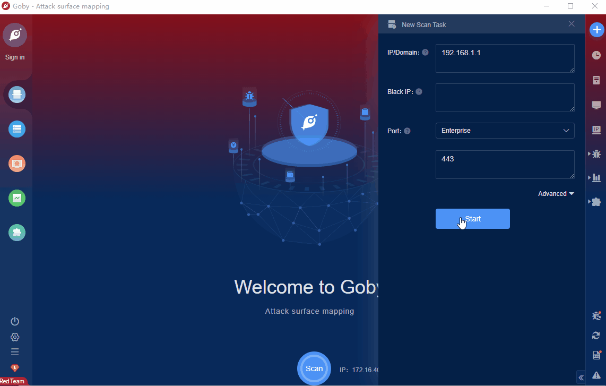

# BIG-IP iControl REST vulnerability (CVE-2022-1388)

BIG-IP is an application delivery service of F5 company, which is oriented to the world's advanced technology with application as the center.&nbsp;With the help of BIG-IP application delivery controller, keep the application running normally.&nbsp;BIG-IP local traffic manager (LTM) and BIG-IP DNS can handle application traffic and protect infrastructure. This vulnerability may allow an unauthenticated attacker with network access to the BIG-IP system through the management port and/or self IP addresses to execute arbitrary system commands, create or delete files, or disable services. There is no data plane exposure; this is a control plane issue only.

FOFA **query rule**: [app="F5-BIGIP"](https://fofapro.com/result?qbase64=YXBwPSJGNS1CSUdJUCI%3D)

# Demo

