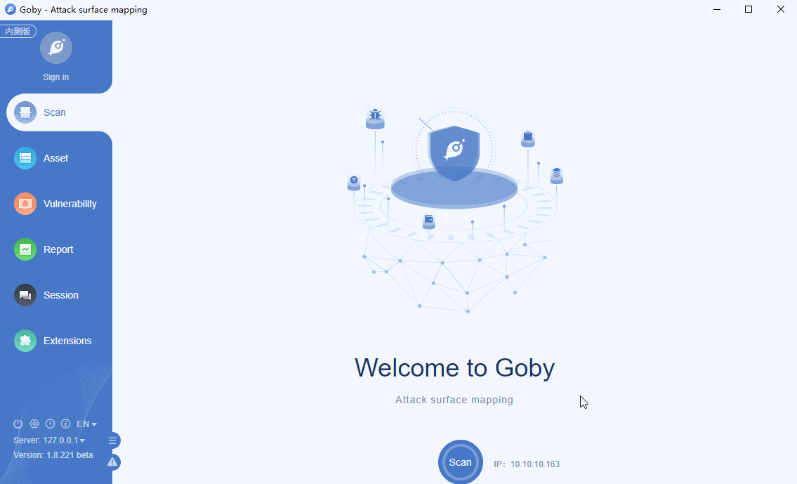

# CNVD-2017-02833 Fastjson 1.2.24 RCE

parseObject in Fastjson before 1.2.25, as used in FastjsonEngine in Pippo 1.11.0 and other products, allows remote attackers to execute arbitrary code via a crafted JSON request, as demonstrated by a crafted rmi:// URI in the dataSourceName field of HTTP POST data to the Pippo /json URI, which is mishandled in AjaxApplication.java.

**Affected version**: Fastjson < 1.2.25

# Demo

