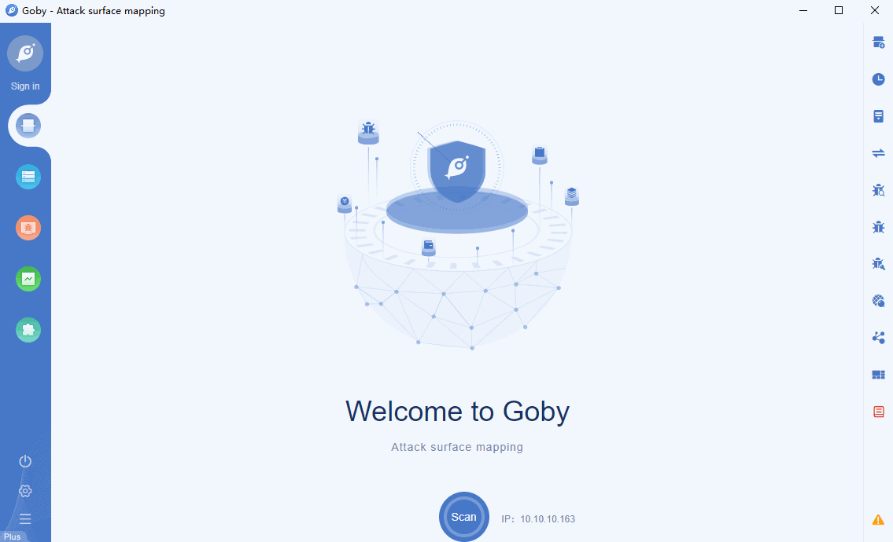

# CVE-2020-17519 Apache Flink Path Traversal

A change introduced in Apache Flink 1.11.0 (and released in 1.11.1 and 1.11.2 as well) allows attackers to read any file on the local filesystem of the JobManager through the REST interface of the JobManager process. Access is restricted to files accessible by the JobManager process. All users should upgrade to Flink 1.11.3 or 1.12.0 if their Flink instance(s) are exposed. The issue was fixed in commit b561010b0ee741543c3953306037f00d7a9f0801 from apache/flink:master.

**[FOFA](https://fofa.so/result?q=app%3D%22Apache+Flink%22&qbase64=YXBwPSJBcGFjaGUgRmxpbmsi) query rule**: app="Apache Flink"

# Demo

