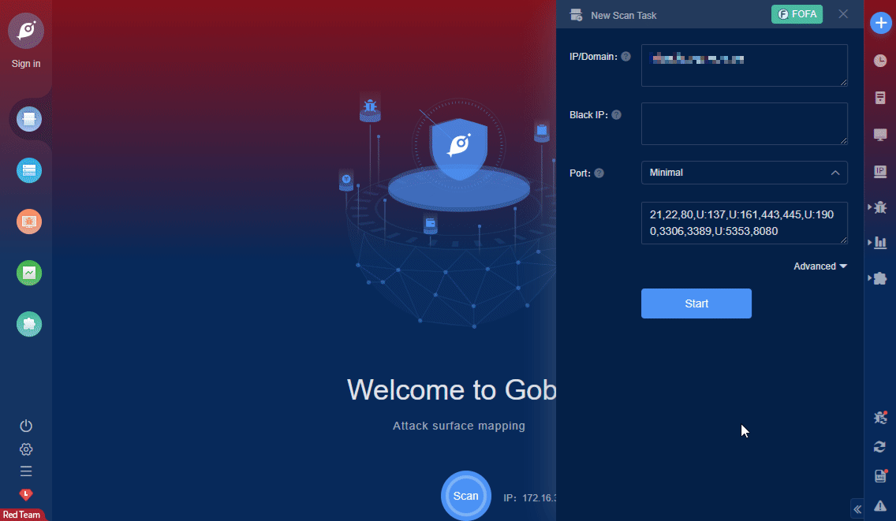

# ForgeRock AM RCE (CVE-2021-35464)

This candidate has been reserved by an organization or individual that will use it when announcing a new security problem. When the candidate has been publicized, the details for this candidate will be provided.

**Affected Version**: AM 6.0.0.x, 6.5.0.x, 6.5.1, 6.5.2.x and 6.5.3

**FOFA query rule**: [app="OpenAM"](https://fofa.so/result?qbase64=YXBwPSJPcGVuQU0i)

# Demo

