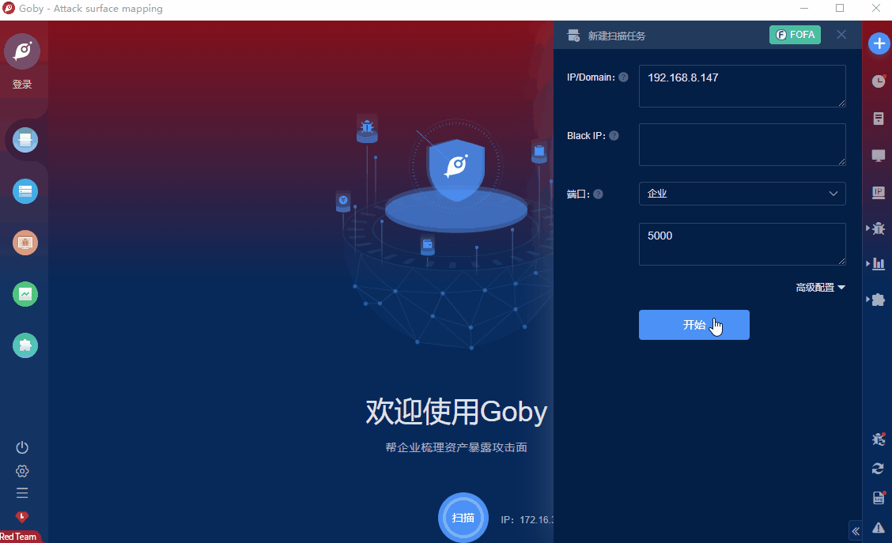

# FortiLogger Unauth Arbitrary File Upload(CVE_2021_3378)

FortiLogger 4.4.2.2 is affected by Arbitrary File Upload by sending a \"Content-Type: image/png\" header to Config/SaveUploadedHotspotLogoFile and then visiting Assets/temp/hotspot/img/logohotspot.asp.

**FOFA query rule**: [app="Fortilogger-|-Log-and-Report-System"](https://fofa.so/result?qbase64=YXBwPSJGb3J0aWxvZ2dlci18LUxvZy1hbmQtUmVwb3J0LVN5c3RlbSI%3D)

# Demo

