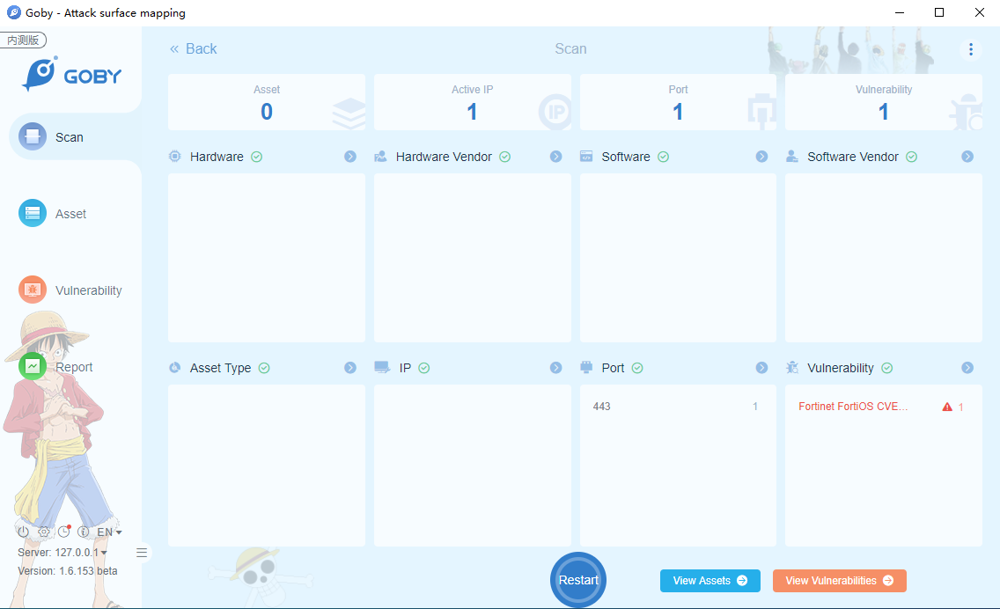
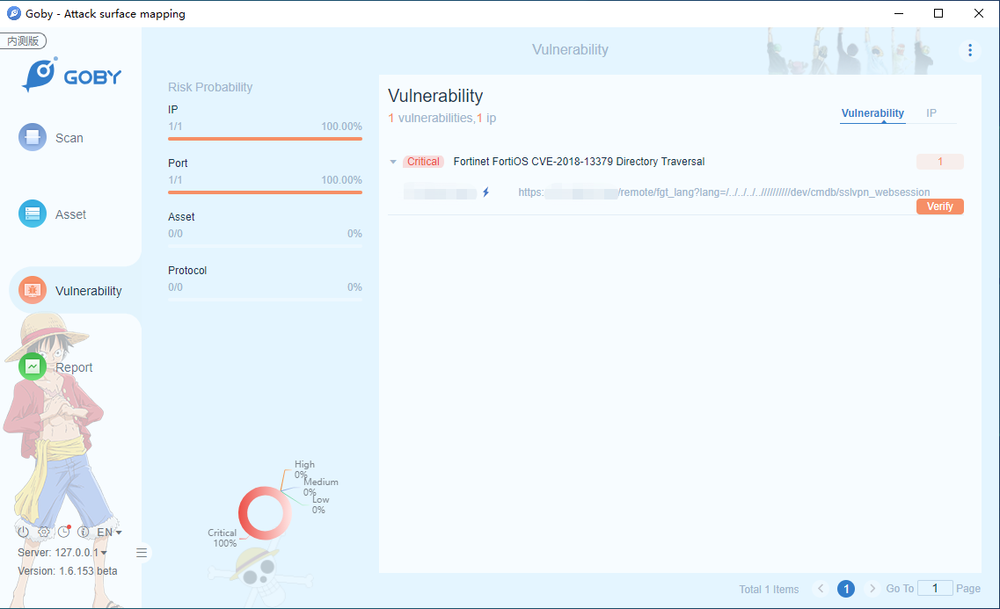

# CVE-2018-13379 Fortinet FortiOS CVE-2018-13379 Directory Traversal Vulnerability

An Improper Limitation of a Pathname to a Restricted Directory ("Path Traversal") in Fortinet FortiOS 6.0.0 to 6.0.4, 5.6.3 to 5.6.7 and 5.4.6 to 5.4.12 under SSL VPN web portal allows an unauthenticated attacker to download system files via special crafted HTTP resource requests.

**Affected Version**: Fortinet FortiOS 6.0.0 - 6.0.4, 5.6.3 - 5.6.7 and 5.4.6 - 5.4.12 under SSL VPN web portal

**[FOFA](https://fofa.so/result?qbase64=YXBwPSJGb3J0aW5ldC1zc2x2cG4i) query rule**: app="Fortinet-sslvpn"

# Demo

