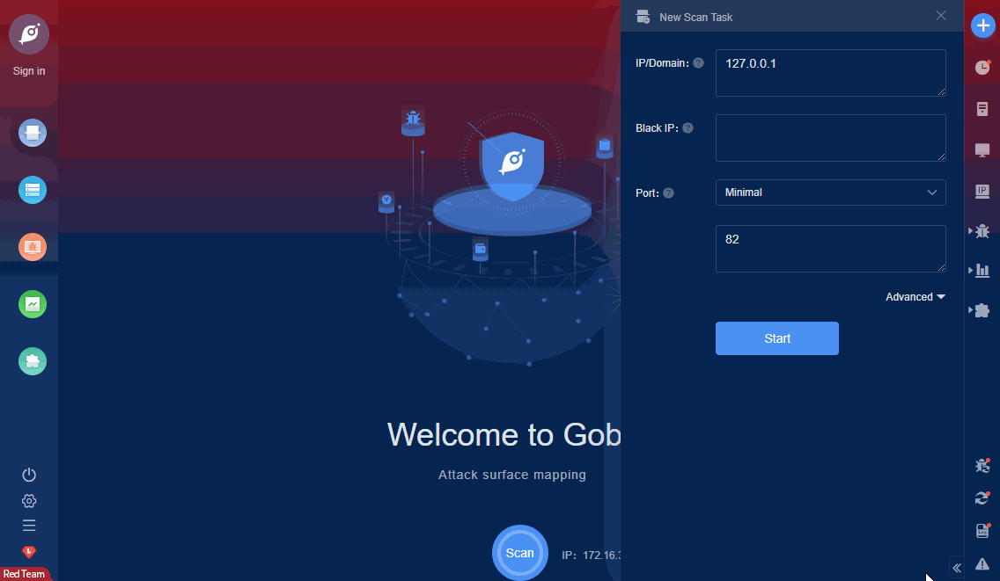

# Geowebserver 5.3.3 Arbitrary File Read

GEOVISION GEOWEBSERVER less than 5.3.3 are vulnerable to several XSS ,HTML Injection ,Local File Include ,XML Injection ,Code execution vectors. The application fails to properly sanitize user requests. This allows injection of HTML code and XSS ,client side exploitation, including session theft.

FOFA **query rule**: [app="Geowebserver"](https://fofa.so/result?qbase64=YXBwPSJHZW93ZWJzZXJ2ZXIi)

# Demo

