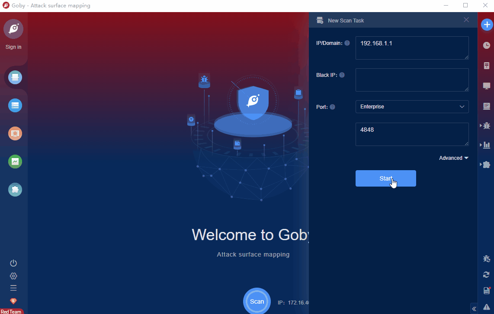

# GlassFish Server Open Source Edition 3.01 Local File Inclusion

Oracle GlassFish Server Open Source Edition is a set of open source versions of Oracle's (Oracle) company's server for building Java EE (server-side Java applications). A local file inclusion vulnerability exists in Oracle GlassFish Server Open Source Edition 3.0.1 (build 22). An attacker could exploit this vulnerability to include arbitrary files on the server. 

FOFA **query rule**: [app="Sun-GlassFish"](https://fofa.info/result?qbase64=YXBwPSJTdW4tR2xhc3NGaXNoIg%3D%3D)

# Demo

