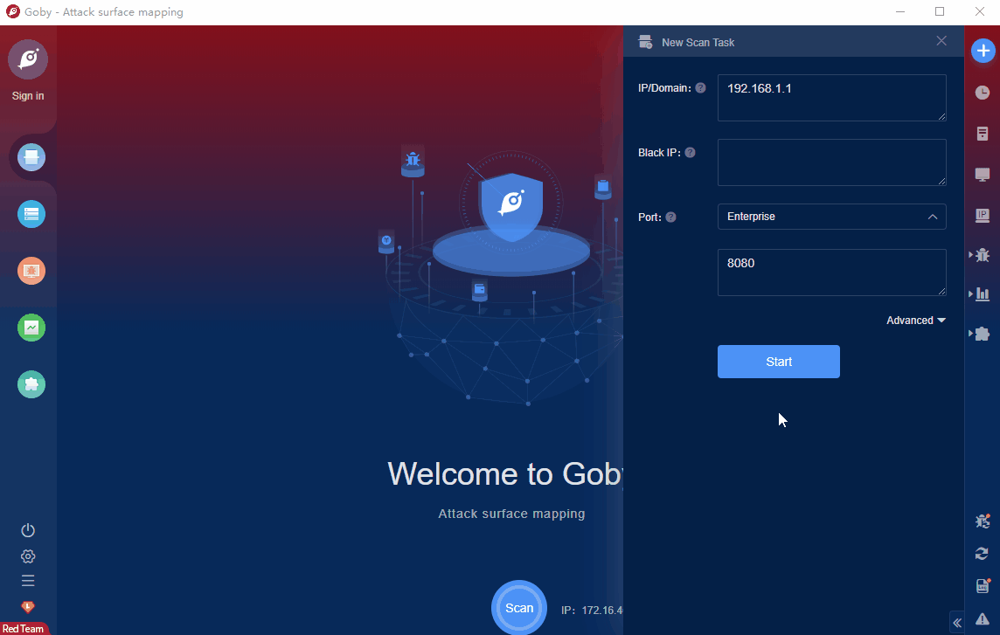

# HD-Network Real-time Monitoring System 2.0 Local File Inclusion (CVE-2021-45043)

HD-Network Real-time Monitoring System 2.0 is a real-time network monitoring product.

HD-Network Real-time Monitoring System 2.0 has a local file inclusion (LFI) vulnerability. Attackers can obtain sensitive user information such as passwords to further control the system.

FOFA **query rule**: [body="zkt_input_s"](https://fofa.so/result?qbase64=Ym9keT0iemt0X2lucHV0X3Mi)

# Demo

