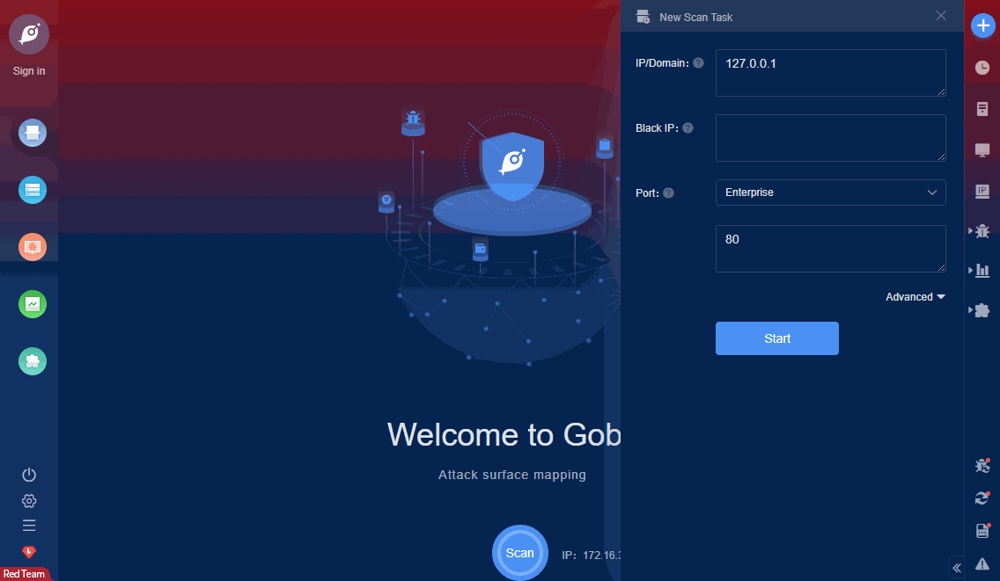

# Hongdian H8922 Arbitrary File Read (CVE-2021-28149)

Hongdian H8922 3.0.5 devices allow Directory Traversal. The /log_download.cgi log export handler does not validate user input and allows a remote attacker with minimal privileges to download any file from the device by substituting ../ (e.g., ../../etc/passwd) This can be carried out with a web browser by changing the file name accordingly. Upon visiting log_download.cgi?type=../../etc/passwd and logging in, the web server will allow a download of the contents of the /etc/passwd file.

FOFA **query rule**: [banner="WWW-Authenticate: Basic realm=" && banner="Server Status"](https://fofa.so/result?qbase64=YmFubmVyPSJXV1ctQXV0aGVudGljYXRlOiBCYXNpYyByZWFsbT0iICYmIGJhbm5lcj0iU2VydmVyIFN0YXR1cyI%3D)

# Demo

