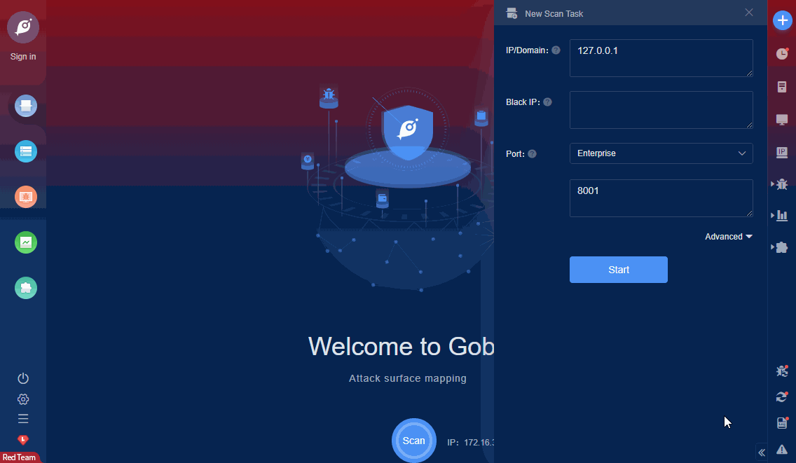

# iRDM4000 cookie bypass

Hebei Huahou Tiancheng Environmental Technology Co., Ltd. is a professional manufacturer of environmental online monitoring equipment and a leading environmental monitoring system integrator. The iRDM4000 smart station room online supervision, diagnosis and configuration sub-station has cookie forgery, which leads to malicious login to the operation background.

FOFA **query rule**: [body="iRDM4000"](https://fofa.so/result?qbase64=Ym9keT0iaVJETTQwMDAi)

# Demo

