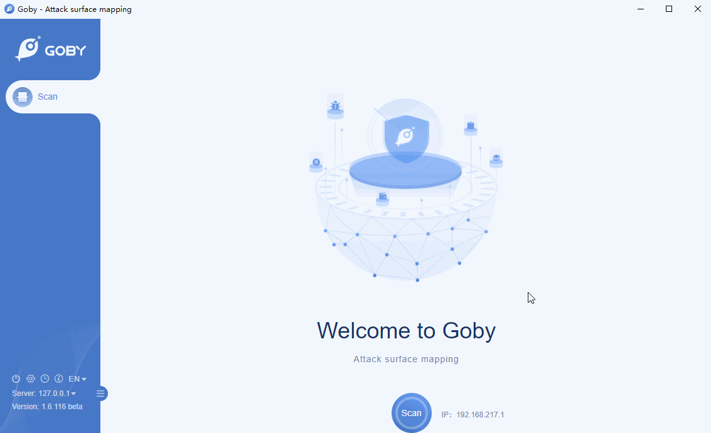

# CVE-2018-1000861 Jenkins Remote Code Execution Vulnerability

A code execution vulnerability exists in the Stapler web framework used by Jenkins 2.153 and earlier, LTS 2.138.3 and earlier in stapler/core/src/main/java/org/kohsuke/stapler/MetaClass.java that allows attackers to invoke some methods on Java objects by accessing crafted URLs that were not intended to be invoked this way.

Affected version: 2.153 and earlier, LTS 2.138.3 and earlier

FOFA query rule: app="Jenkins"

# Demo

