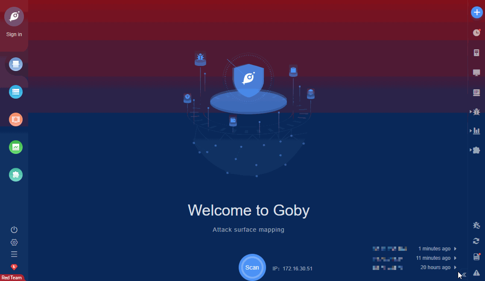

# Jetty File Read (CVE-2021-34429)

For Eclipse Jetty versions 9.4.37-9.4.42, 10.0.1-10.0.5 & 11.0.1-11.0.5, URIs can be crafted using some encoded characters to access the content of the WEB-INF directory and/or bypass some security constraints. This is a variation of the vulnerability reported in CVE-2021-28164/GHSA-v7ff-8wcx-gmc5.

FOFA **query rule**: [app="Jetty"](https://fofa.so/result?qbase64=YXBwPSJKZXR0eSI%3D)

# Demo

