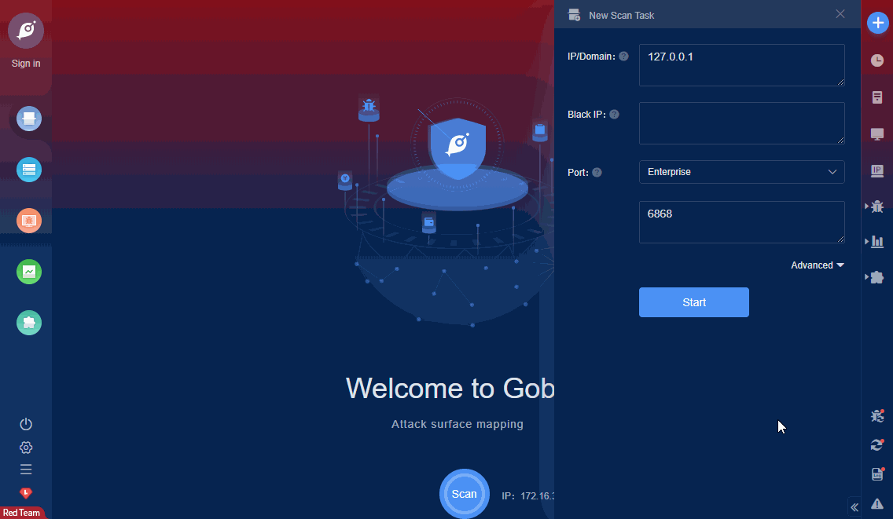

# Kingsoft V8 V9 get_file_content.php Arbitrary File Read

Kingsoft V8, V9 terminal security system has arbitrary file reading vulnerabilities. Attackers can download arbitrary files in the WEB directory through the vulnerabilities.

FOFA **query rule**: [body="金山安全管理" && title="终端安全系统"](https://fofa.so/result?qbase64=Ym9keT0i6YeR5bGx5a6J5YWo566h55CGIiYmdGl0bGU9Iue7iOerr%2BWuieWFqOezu%2Be7nyI%3D)

# Demo

