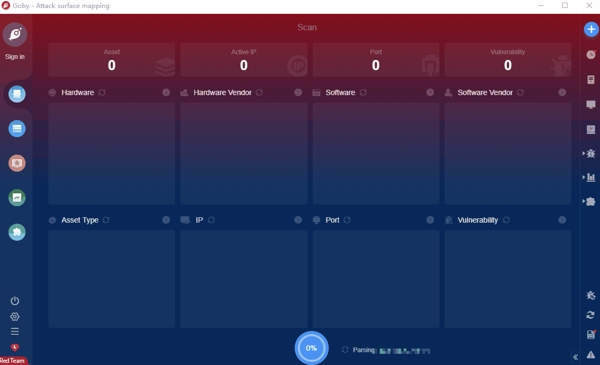

# Klog Server Unauth RCE(CVE-2020-35729)

The 'authenticate.php' file uses the 'user' HTTP POST parameter in a call to the 'shell_exec()' PHP function without appropriate input validation,allowing arbitrary command execution as the apache user.

**Affected Version**:  ≤2.4.1

**FOFA query rule**: [title="KLog Server" && body="authenticate.php"](https://fofa.so/result?qbase64=dGl0bGU9IktMb2cgU2VydmVyIiYmYm9keT0iYXV0aGVudGljYXRlLnBocCI%3D)

# Demo

