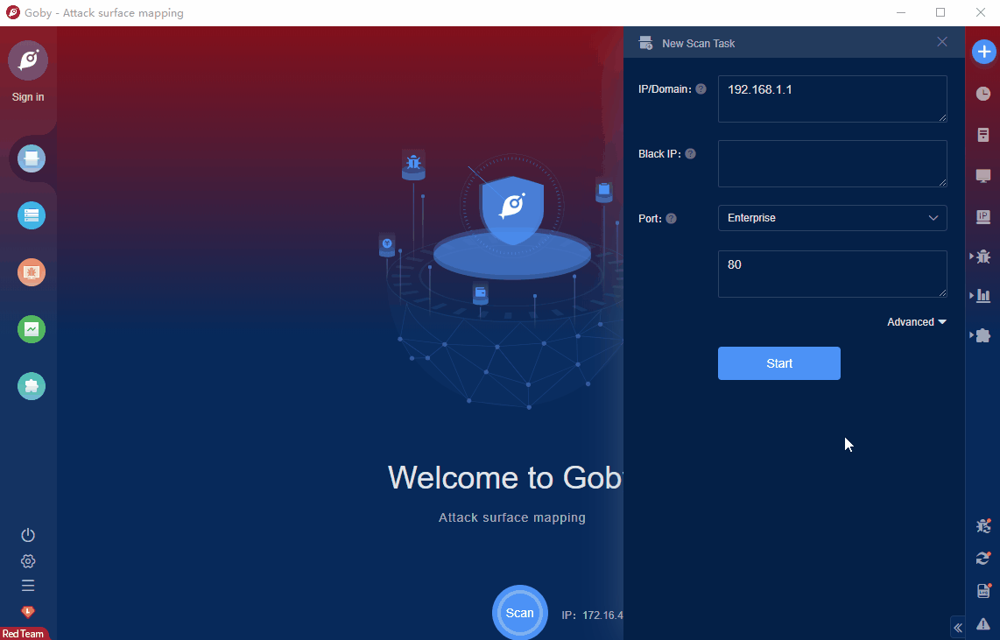

# Tableau Server log4j2 RCE

Tableau Software Server is a set of file hosting servers from Tableau Software. This product is mainly used to manage and share data visualization, interactive dashboards, workbooks and reports created by Tableau Desktop data visualization software.

Tableau Server has a CVE-2021-44228 vulnerability. Attackers can use the vulnerability to execute code remotely and control server permissions.

FOFA **query rule**: [banner="Server: Tableau" || header="Server: Tableau"](https://fofa.so/result?qbase64=YmFubmVyPSJTZXJ2ZXI6IFRhYmxlYXUiIHx8IGhlYWRlcj0iU2VydmVyOiBUYWJsZWF1Ig%3D%3D)

# Demo

