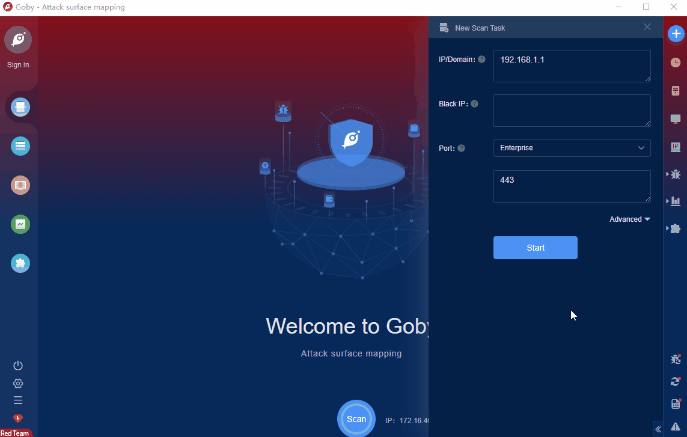

# VMware NSX log4j2 RCE

Various VMware products such as VMware Horizon, VMware vCenter Server, VMware HCX, VMware NSX-T Data Center, etc. are affected by the remote code execution vulnerability CVE-2021-44228.Attackers can use the vulnerability CVE-2021-44228 to cause remote code execution and control server permissions.

FOFA **query rule**: [body="VMware NSX" || body="VMware Appliance Management"](https://fofa.so/result?qbase64=Ym9keT0iVk13YXJlIE5TWCIgfHwgYm9keT0iVk13YXJlIEFwcGxpYW5jZSBNYW5hZ2VtZW50Ig%3D%3D)

# Demo

