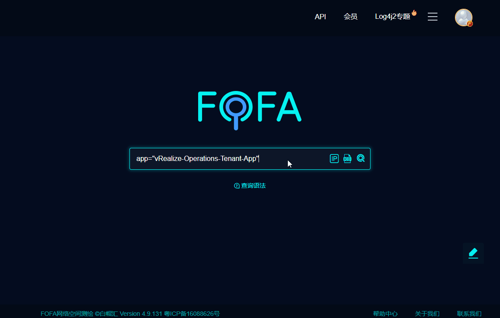

# VMware vRealize Operations Tenant App log4j2 RCE

Various VMware products such as VMware Horizon, VMware vCenter Server, VMware HCX, VMware NSX-T Data Center, etc. are affected by the remote code execution vulnerability CVE-2021-44228.Attackers can use the vulnerability CVE-2021-44228 to cause remote code execution and control server permissions.

FOFA **query rule**: [app="vRealize-Operations-Tenant-App"](https://fofa.so/result?qbase64=YXBwPSJ2UmVhbGl6ZS1PcGVyYXRpb25zLVRlbmFudC1BcHAi)

# Demo

