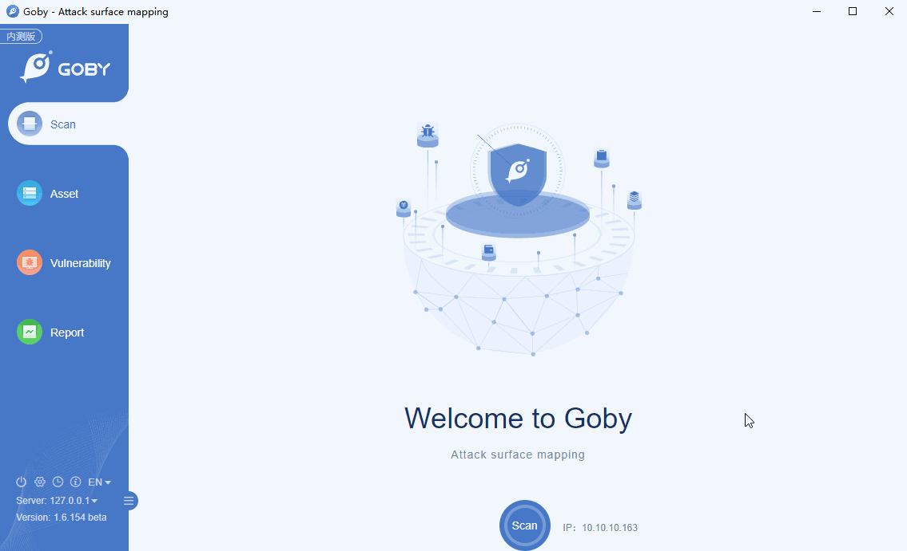

# CVE-2020-10189 Zoho ManageEngine Desktop Central 10 getChartImage rce

Zoho ManageEngine Desktop Central 10 allows remote code execution because of deserialization of untrusted data in getChartImage in the FileStorage class. This is related to the CewolfServlet and MDMLogUploaderServlet servlets.

**[FOFA](https://fofa.so/result?qbase64=YXBwPSJab2hvLU1hbmFnZUVuZ2luZS1EZXNrdG9wIg%3D%3D) query rule**: app="Zoho-ManageEngine-Desktop"

# Demo

