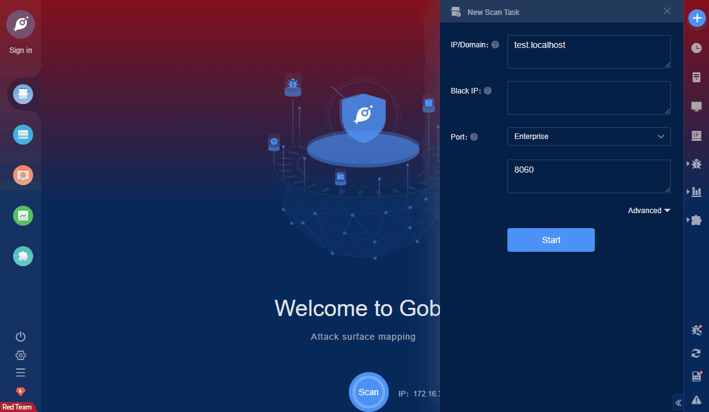

# ManageEngine OpManager RCE (CVE-2020-28653)

Zoho ManageEngine OpManager Stable build before 125203 (and Released build before 125233) allows Remote Code Execution via the Smart Update Manager (SUM) servlet.

**FOFA query rule**: [title="ManageEngine OpManager"](https://fofa.so/result?qbase64=dGl0bGU9Ik1hbmFnZUVuZ2luZSBPcE1hbmFnZXIi)

# Demo

