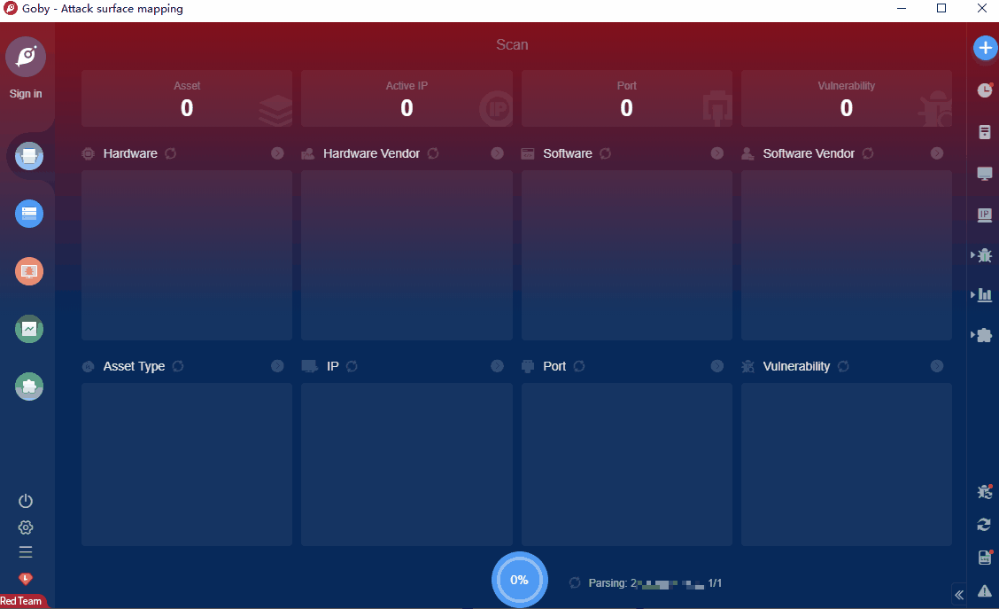

# Mida eFramework ajaxreq.php RCE(CVE-2020-15920)

There is an OS Command Injection in Mida eFramework through 2.9.0 that allows an attacker to achieve Remote Code Execution (RCE) with administrative (root) privileges. No authentication is required.

**Affected Version**:  ≤2.9.0

**FOFA query rule**: [body="eFramework.css" && body="MUP"](https://fofa.so/result?qbase64=Ym9keT0iZUZyYW1ld29yay5jc3MiICYmIGJvZHk9Ik1VUCI%3D)

# Demo

