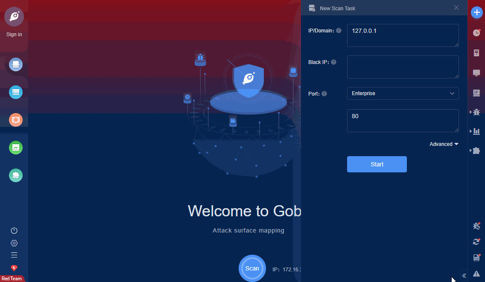

# Mobinat Wireless Router system_log.cgi RCE

Mobinat Wireless Router system_log.cgi has a remote command execution vulnerability, requiring at least one users is online. This PoC will try to log in using admin/admin first.

FOFA **query rule**: [app="Mobinat-Wireless-Router](https://fofa.so/result?qbase64=YXBwPSJNb2JpbmF0LVdpcmVsZXNzLVJvdXRlciI%3D)

# Demo

