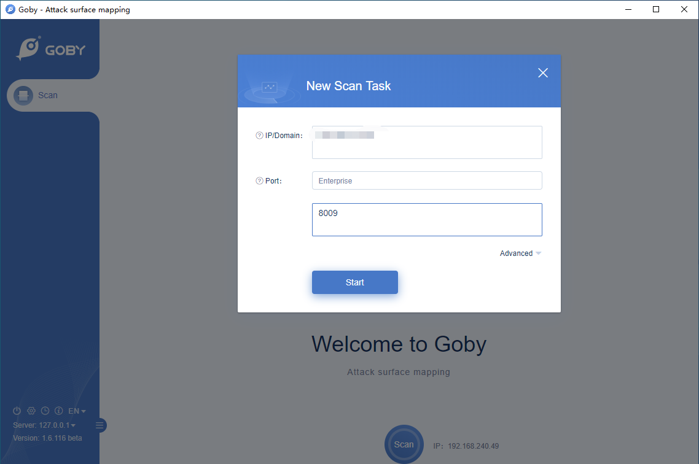
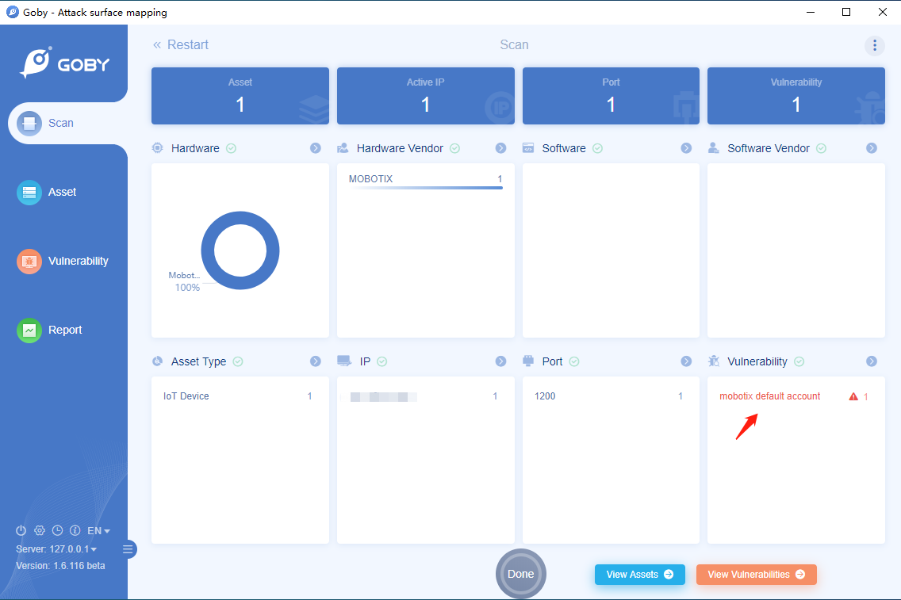
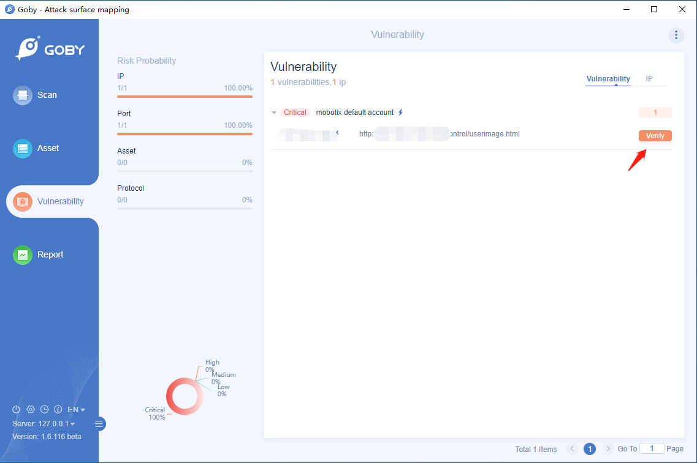
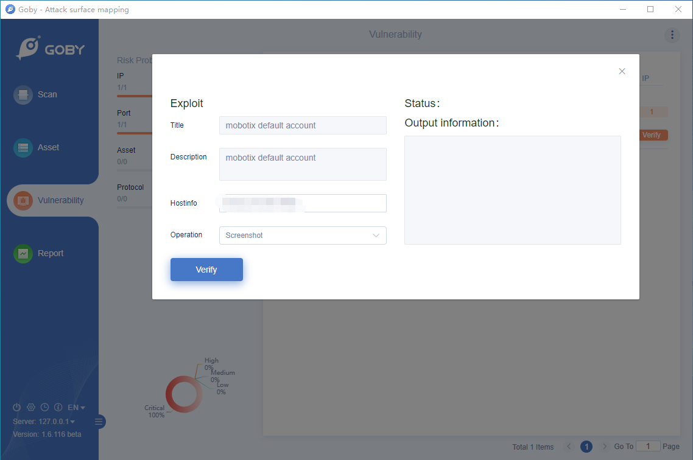

# Mobotix default account

Attackers can easily obtain default passwords and identify internet-connected target systems. Passwords can be found in product documentation and compiled lists available on the internet. An attacker with knowledge of the password and network access to a system can log in, usually with root or administrative privileges. Further consequences depend on the type and use of the compromised system.

**[FOFA](https://fofa.so/result?qbase64=YXBwPSJNb2JvdGl4LUNhbWVyYSI%3D) query rule**: app="Mobotix-Camera"

# Demo

