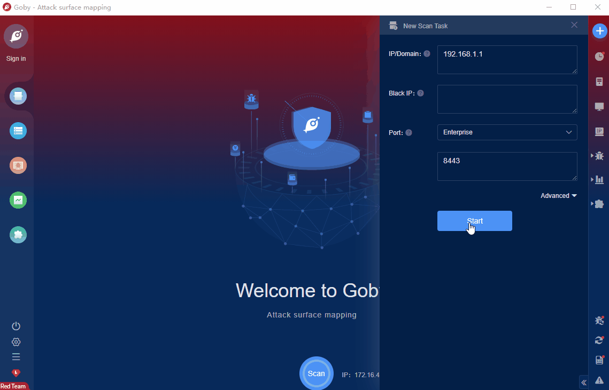

# NETGEAR DGND3700v2 c4_IPAddr RCE

The NETGEAR DGND3700v2 is an efficient enterprise router. NETGEAR DGND3700v2 has a command execution vulnerability, an attacker can execute arbitrary commands and control server permissions.

FOFA **query rule**: [app="NETGEAR-DGND3700"](https://fofa.info/result?qbase64=YXBwPSJORVRHRUFSLURHTkQzNzAwIg%3D%3D)

# Demo

