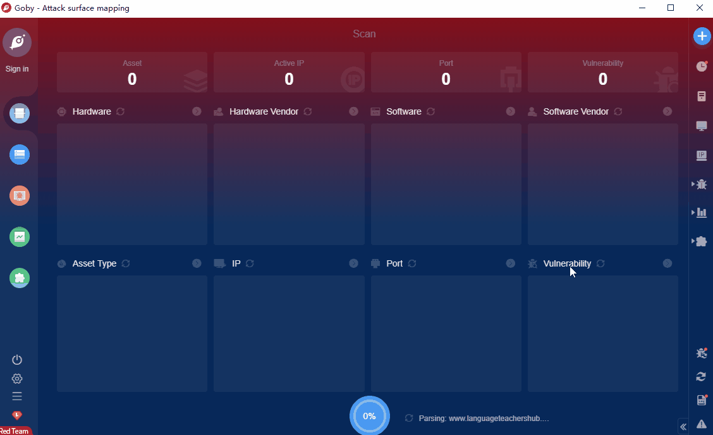

# Nette Framework RCE(CVE-2020-15227)

Nette versions before 2.0.19, 2.1.13, 2.2.10, 2.3.14, 2.4.16, 3.0.6 are vulnerable to an code injection attack by passing specially formed parameters to URL that may possibly leading to RCE. Nette is a PHP/Composer MVC Framework.

**Affected Version**:  before 2.0.19, 2.1.13, 2.2.10, 2.3.14, 2.4.16, 3.0.6

**FOFA query rule**: [app="NetteFramework"](https://fofa.so/result?qbase64=YXBwPSJOZXR0ZUZyYW1ld29yayI%3D)

# Demo

