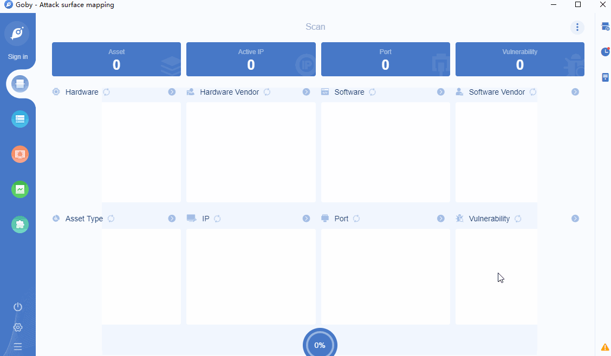

# CVE-2019-7238 Nexus Repository Manager 3 RCE

Sonatype Nexus Repository Manager before 3.15.0 has Incorrect Access Control.

**Affected version**: Nexus < 3.15.0 

**[FOFA](https://fofa.so/result?qbase64=YXBwPSJOZXh1cy1SZXBvc2l0b3J5LU1hbmFnZXIi) query rule**: app="Nexus-Repository-Manager"

# Demo

