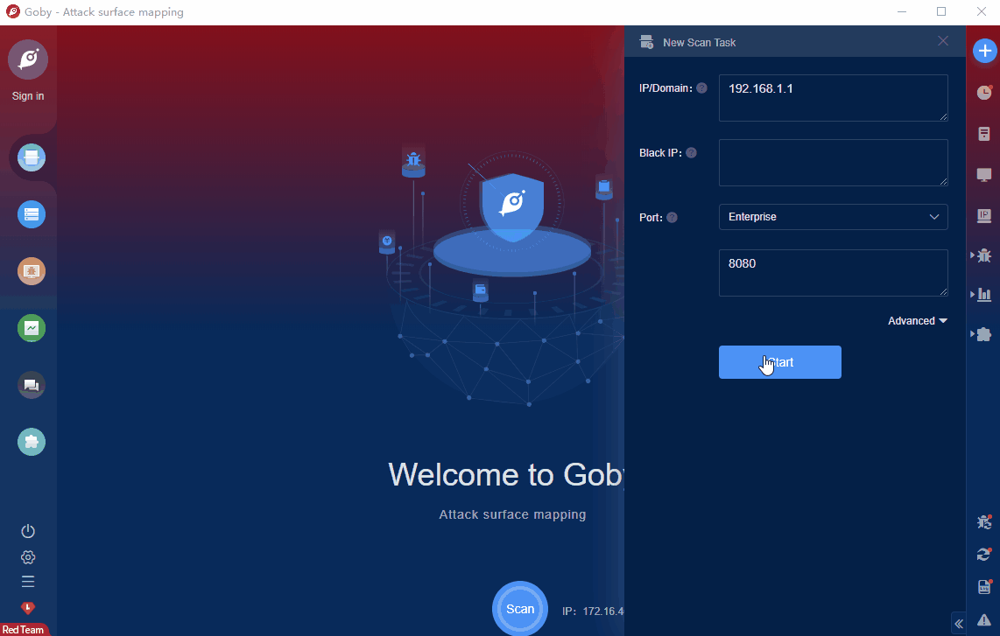

# NUUO Network Video handle_load_config.php Unauth Command Execution vulnerability(CVE-2019-9653)

NUUO Inc. is a company providing a video-centric surveillance solution. They have many NVR (Network Video Recorder) products for different customers with various requirements. These NVRs are Linux embedded video recording systems that can manage several cameras. Nowadays, they are used worldwide by many public institutions, companies, banks, or individuals, etc. The web interface of these NVR systems contains a lot of critical vulnerabilities can be abused by unauthenticated attackers. We discover that some vulnerable PHP scripts are lack of authentication mechanism and input protection thus they could be abused to achieve remote code execution on NUUO's devices as root. 

FOFA **query rule**: [body="NUUO"&&title="Network Video Recorder Login"](https://fofa.info/result?qbase64=Ym9keT0iTlVVTyImJnRpdGxlPSJOZXR3b3JrIFZpZGVvIFJlY29yZGVyIExvZ2luIg%3D%3D)

# Demo

