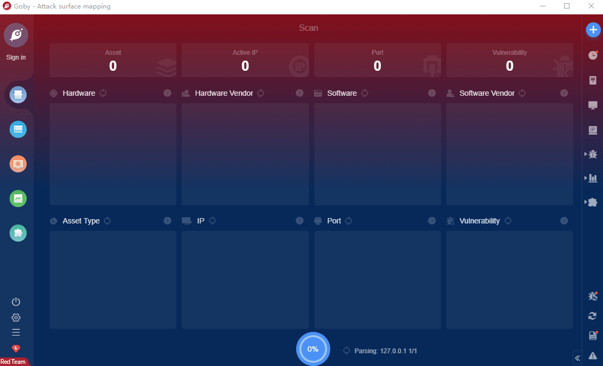

# PHP 8.1.0-dev Zerodium Backdoor vulnerabilities

PHP 8.1.0-dev is a development version of PHP. The PHP 8.1.0-dev version was implanted with a backdoor on March 28, 2021, but the backdoor was quickly discovered and removed. When the backdoor exists on the server, the attacker can execute arbitrary code by sending the User-Agentt header.

**FOFA query rule**: [header="PHP/8.1.0"](https://fofa.so/result?qbase64=aGVhZGVyPSJQSFAvOC4xLjAi)

# Demo

