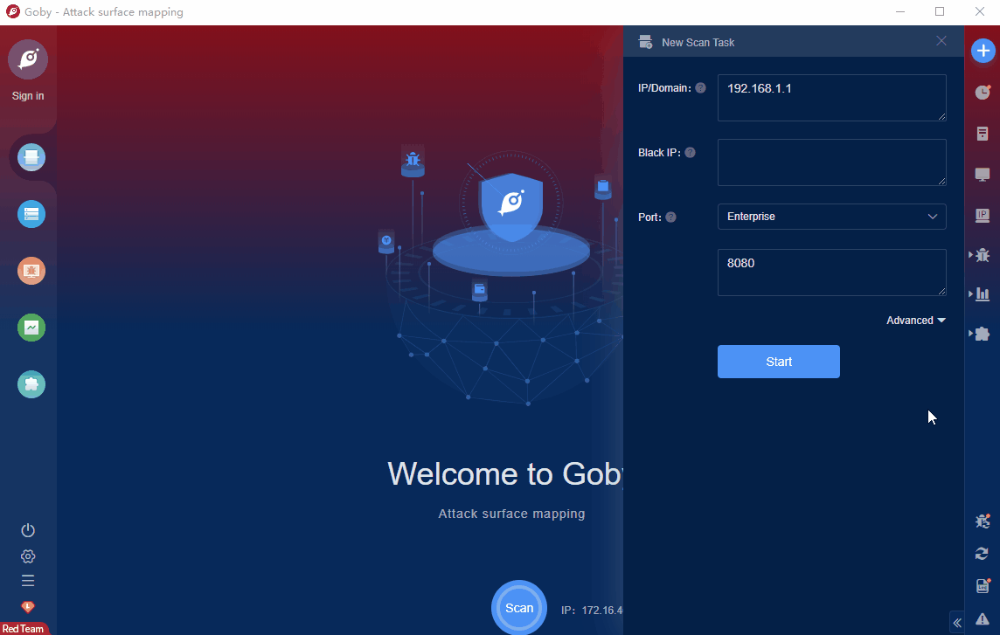

# PPGo_Job Auth Login Bypass

PPGo_Job is a visual, multi-person, multi-authority, one-task, multi-machine timing task management system. It is developed by golang, is easy to install, consumes less resources, supports large concurrency, and can manage timing tasks on multiple servers at the same time.

The PPGo_Job timing task management system has an authentication bypass vulnerability. Attackers can bypass auth authentication to obtain sensitive system information and further control the system.

FOFA **query rule**: [body="/static/layui/layui.js?t=1504439386550"&& body="window.location.href"](https://fofa.so/result?qbase64=Ym9keT0iL3N0YXRpYy9sYXl1aS9sYXl1aS5qcz90PTE1MDQ0MzkzODY1NTAiJiYgYm9keT0id2luZG93LmxvY2F0aW9uLmhyZWYi)

# Demo

